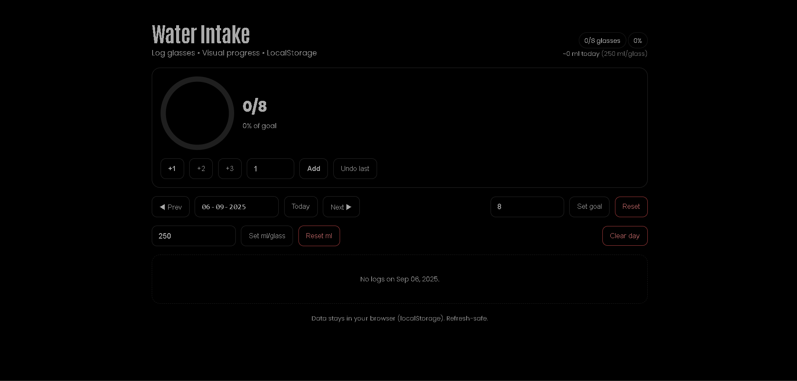

# Water Intake Reminder (React + styled-components)



**Live Demo:** https://a2rp.github.io/water-intake/

A lightweight, frontend-only water tracker built with **React + styled-components**. Log glasses, see a **visual progress ring**, and configure **daily goal** and **per-glass (ml)** size. Transparent UI to blend with a black/dark theme.

## Features

-   One-tap **+1 / +2 / +3** and custom add
-   **Progress ring** with % completed
-   **Daily goal** (set/reset with confirm)
-   **Per-glass size (ml)** (set/reset with confirm)
-   **Date controls**: Prev / Today / Next
-   **Undo last** and **Clear Day** (with confirm)
-   **LocalStorage** persistence
-   **Custom confirm modal** (no portals)
-   Black-theme friendly (no background overrides)

## Local Install

```bash
# 1) Clone the repo
git clone https://github.com/a2rp/water-intake.git
cd water-intake

# 2) Install dependencies
npm i

# 3) Run dev server
npm run dev
```
