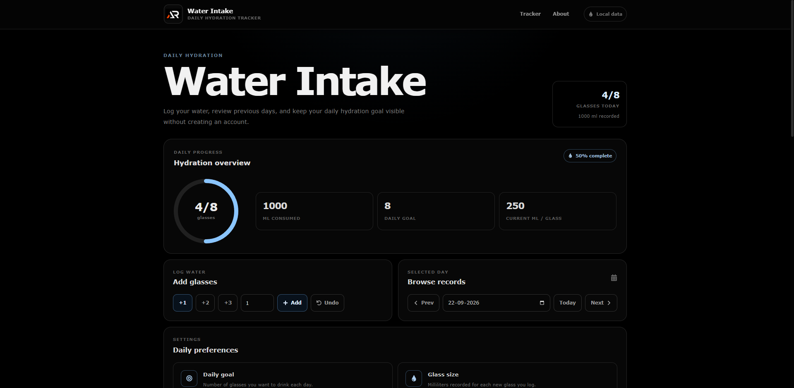

# Water Intake

Water Intake is a simple daily hydration tracker built with React, Vite, and styled-components.

It helps you log water, set a daily target, choose your glass size, review previous days, and keep hydration progress visible without creating an account.



## Features

- Log one or multiple glasses quickly
- Add a custom number of glasses
- Set a daily water goal
- Configure glass size in milliliters
- Browse previous and upcoming dates
- View daily hydration progress
- Track total milliliters consumed
- Keep the original milliliter value for every logged entry
- Undo the latest entry
- Delete individual water entries
- Clear all entries for a selected day
- Confirmation for destructive actions
- Local browser storage
- Responsive dark interface
- Fixed header with scroll hide and show behavior
- Mobile navigation
- Floating back-to-top button
- No account or backend required

## Tech Stack

- React
- Vite
- JavaScript
- styled-components
- React Icons
- LocalStorage
- GitHub Pages

## Project Structure

```text
src
├── components
│   ├── about
│   ├── backToTop
│   ├── confirmModal
│   ├── footer
│   ├── header
│   ├── intakeControls
│   ├── intakeHistory
│   ├── progressCard
│   ├── settings
│   └── waterIntake
├── constants
│   └── waterConstants.js
├── hooks
│   └── useLocalStorage.js
├── utils
│   └── waterUtils.js
├── App.jsx
├── App.styled.js
├── index.css
└── main.jsx
```

## Getting Started

Clone the repository:

```bash
git clone https://github.com/a2rp/water-intake.git
```

Open the project:

```bash
cd water-intake
```

Install dependencies:

```bash
npm install
```

Start the development server:

```bash
npm run dev
```

## Build

Create a production build:

```bash
npm run build
```

Preview the production build:

```bash
npm run preview
```

## Deployment

The project is configured for GitHub Pages with the base path:

```text
/water-intake/
```

Deploy with:

```bash
npm run deploy
```

## Data Storage

Water records, daily goal, and glass size are stored locally in the browser using LocalStorage.

Each water entry stores its own milliliter value, so changing the glass size later does not change previously logged amounts.

Clearing browser storage may remove saved data.

## Future Prospects

- Add weekly and monthly hydration summaries
- Add simple hydration trends and statistics
- Add optional reminder support
- Add export and import for water history
- Add additional goal presets

## License

This project is licensed under the MIT License.

## Links

- [Portfolio](https://www.ashishranjan.net)
- [GitHub](https://github.com/a2rp)
- [CodePen](https://codepen.io/ash1198)
- [LinkedIn](https://www.linkedin.com/in/aashishranjan)
- [Facebook](https://www.facebook.com/theash.ashish)
- [YouTube](https://www.youtube.com/channel/UCLHIBQeFQIxmRveVAjLvlbQ)
- [Email](mailto:ash.ranjan09@gmail.com)

## Support

- [Support](https://a2rp-donation-page.netlify.app/)
- [Buy Me a Coffee](https://buymeacoffee.com/a2rp)
- [Patreon](https://www.patreon.com/a2rp)
